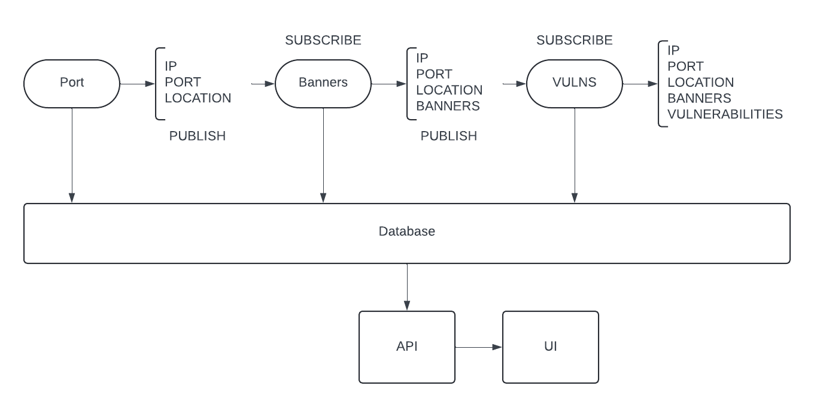

# Rigour: An IoT Scanner Inspired by Shodan.io

Rigour is a comprehensive Internet of Things (IoT) scanning tool designed to discover, analyze, and report on devices connected to the internet. By leveraging powerful tools like ZMap and ZGrab, Rigour performs large-scale network scans to identify active hosts, retrieve service banners, and detect potential vulnerabilities. It offers both REST and streaming APIs for data access, and includes a user interface for data visualization.

## Get Started

To quickly set up Rigour and its services, use Docker Compose:

```bash
docker compose up
```

This command initializes all components required for scanning, data processing, and data access.

## Architecture Overview



Rigour's architecture comprises several interconnected components that work in harmony to perform comprehensive network scanning and analysis.

### Components

#### Port Scanner

The **Port Scanner** uses [ZMap](https://github.com/zmap/zmap) to scan specified port ranges and identify active hosts on the internet. Discovered hosts are published to a RabbitMQ queue in the format `{country}.{port}.{ip}.port`. This allows other services to consume live data for further processing. Additionally, scan results are stored in the database for persistent access.

#### Banner Grabber

The **Banner Grabber** employs [ZGrab](https://github.com/zmap/zgrab2) to retrieve service banners from the identified hosts, providing detailed information about running services (e.g., SSH, HTTP). This service subscribes to the `{country}.{port}.{ip}.port` queue and publishes the collected banners to `{country}.{port}.{ip}.banners`. The database entries for each host are updated with this new information.

#### Vulnerability Scanner

The **Vulnerability Scanner** analyzes the collected banner data to detect vulnerable servers by cross-referencing with CVE databases. It examines identifiers such as HTTP server headers against known vulnerabilities. This service subscribes to the `{country}.{port}.{ip}.banners` queue and publishes its findings to `{country}.{port}.{ip}.vulns`. Host documents in the database are updated with vulnerability details.

### Data Access Interfaces

#### REST API

Rigour provides a RESTful API to access the scanned host data programmatically. The API allows for querying hosts, services, and vulnerabilities.

- **Documentation**: Detailed API documentation is available [here](./api/README.md).

#### Streaming API

For real-time data processing, Rigour offers a streaming API via RabbitMQ queues.

##### Queue Structure

The RabbitMQ queues follow this naming convention:

```bash
{country}.{port}.{ip}.{data_type}
```

##### Message Components

- **`{country}`**: Two-letter country code (e.g., `US` for the United States)
- **`{port}`**: Port number being scanned (e.g., `443`)
- **`{ip}`**: IP address of the host (e.g., `192.168.1.1`)
- **`{data_type}`**: Type of data (`port`, `banners`, or `vulns`)

##### Example

```bash
US.443.192.168.1.1.port
```

This structure facilitates easy identification and routing of data based on geographic location, port, host, and data type.

### User Interface

A web-based **User Interface** is available for visualizing scan results and interacting with the data.

> **Note**: The user interface is in early development stages and requires manual startup.

## Considerations

1. **Network Capacity**: High scanning rates set in ZMap may consume significant network bandwidth, potentially causing other services to experience latency or connectivity issues.
2. **Process Resilience**: Current processes do not automatically resume after a crash. If a service like the Banner Grabber fails, it will not pick up where it left off upon restarting. Enhancements to address this limitation are planned for future releases.

## Future Enhancements

- **ISP/Organization Mapping**: Incorporate mapping of IP addresses to Internet Service Providers or organizations to provide more context.
- **DNS Mapping**: Implement DNS resolution to associate hostnames with IP addresses.
- **Campaign Configurability**: Introduce configurable scanning campaigns, allowing users to specify ports, protocols, and data types to capture.
